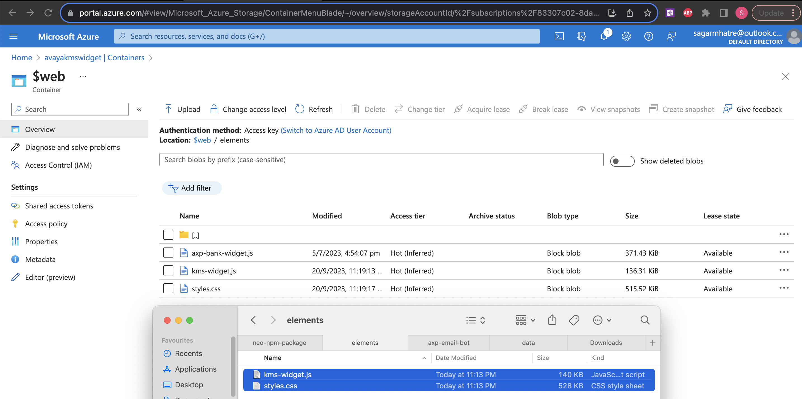
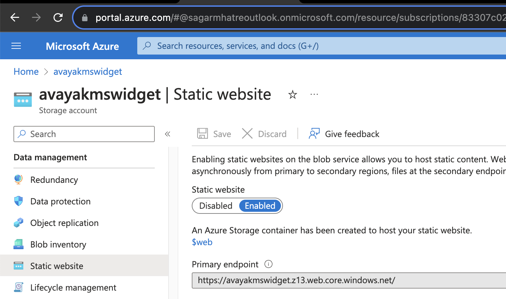

## Tools 
In VS Code , install extension https://marketplace.visualstudio.com/items?itemName=Angular.ng-template
    

## Get started with Basic Web App - run locally

```sh
ng new $PROJECT_NAME
cd $PROJECT_NAME
npm install @angular/elements
ng g component $WIDGET_NAME -v None
```

WIDGET_NAME.component.ts
```js
//encapsulation: ViewEncapsulation.None
encapsulation: ViewEncapsulation.Emulated
```

src/app/app.component.html  
Replace the content with
```html
<app-widget></app-widget>
```

ng serve

http://localhost:4200/

## add Neo CSS library

Download from https://design.avayacloud.com/components/web/setup-web#CompiledCSS
Extract the neo folder such that there will be 4 folders  
- src/app/neo/dist/css/colors
- src/app/neo/dist/css/fonts
- src/app/neo/dist/css/icons
- src/app/neo/dist/css/neo

src/styles.css
```css
@import "app/neo/dist/css/neo/neo.css"
```

Now, in the componenet, you can use the HTML code from e.g. https://design.avayacloud.com/components/web/buttons-web
```html
<button class="neo-btn neo-btn-primary neo-btn-primary--default">
  Search
</button>
```

## Read text input on button click
npm install @angular/forms --save

src/app/app.module.ts
```ts
import { FormsModule } from '@angular/forms'; // Import FormsModule for ngModel
//...
  imports: [
    FormsModule
```

widget.component.html
```html
    <input
        [(ngModel)]="tagInput" name="tagInput"
        class="neo-input"
        id="input1"
        type="text"
    />
    <button class="neo-btn neo-btn-primary neo-btn-primary--default" (click)="handleSubmit()" >  Search </button>
```

widget.component.ts
```ts
 tagInput: string = '';

  handleSubmit() {
    console.log(this.tagInput) ...
```


## To make it a widget component ...

Navigate to /src/app directory and import the following elements into app.module.ts:
```js
import  { Injector} from '@angular/core';
import  { createCustomElement } from '@angular/elements';

// export class AppModule { }
export class AppModule {
  constructor(private injector: Injector) {
      const componentElement = createCustomElement(AxpKmsWidgetComponent, { injector });
      customElements.define('app-axp-kms-widget', componentElement);
  }
  
  ngDoBootstrap() {}
  }


```
Steps 6 to 9 from https://documentation.workspaces.avayacloud.com/widget-framework/docs/api-reference/tools-and-config/angular-widgets#procedure

( I could not do step 7 , but it did not matter )

```sh
ng build
```

```js
// concatenate.js
const fs = require('fs-extra');
const concat = require('concat');

(async function build() {
    const files = [
        './dist/kms-widget/runtime.js',
        './dist/kms-widget/polyfills.js',
        './dist/kms-widget/main.js',
    ]

await fs.ensureDir('elements')
await concat(files, 'elements/kms-widget.js');
await fs.copyFile('./dist/kms-widget/styles.css', 'elements/styles.css')
// Note : We used the name of the project that we created in the ng new $PROJECT_NAME step above 
})()

```

> npm install fs-extra concat --save-dev

Add the following build script into the package.json file. Note: When ran, it generates the Angular build files and uses the concatenate script to bundle them into a single file.

```json
{
    "scripts": {
    "build:elements": "ng build --configuration production --output-hashing none && node concatenate.js"
}
```
```sh
npm run build:elements
```

This generates the component .js file in the elements folder
Host this json file publicly e.g. 



Get the public URL ...


Compose the widget json ...

```json
{
  "name": "AXP KMS Widget",
  "description": "AXP KMS Widget",
  "tags": ["widget", "kms"],
  "version": "1.0.0",
  "id": "cb578f1f-ee8b-47e8-b2f6-363f92c2c339",
  "element": "<app-axp-kms-widget></app-axp-kms-widget>",
  "icon": "aoc-home",
  "files": [
    "/elements/kms-widget.js"
  ],
  "override_url": "https://avayakmswidget.z13.web.core.windows.net";
}
```


## to Test locally again

1. src\app\app.module.ts
```ts
    // uncomment 
    bootstrap: [AppComponent]
```
2. ng serve -o 


Events 
https://documentation.workspaces.avayacloud.com/widget-framework/docs/api-reference/examples/hello-world