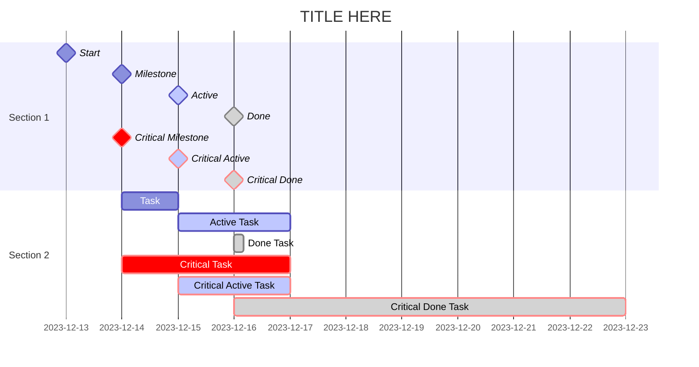

```mermaid

%% This is a comment
gantt
    title TITLE HERE
    tickInterval 1day
    section Section 1
        Start : milestone, m0, 2023-12-13 00:00, 0
        Milestone : milestone, m10,  2023-12-14 00:00, 0
        Active : milestone, active, m11, 2023-12-15 00:00, 0
        Done : milestone, done, m12, 2023-12-16 00:00, 0
        Critical Milestone : milestone, crit, m20, 2023-12-14 00:00, 0
        Critical Active : milestone, crit, active, m21, 2023-12-15 00:00, 0
        Critical Done : milestone, crit, done, m22, 2023-12-16 00:00, 0
    section Section 2
        Task : t10, 2023-12-14 00:00, 1d
        Active Task:  active, t11, 2023-12-15 00:00, 2d
        Done Task:  done, t12, 2023-12-16 00:00, 4h 
        % Can't read text
        Critical Task :  crit, t20, 2023-12-14 00:00, 3d
        Critical Active Task:  crit, active, t21, 2023-12-15 00:00, 2d
        Critical Done Task:  crit, done, t22, 2023-12-16 00:00, 1w
        % Can't read text


```